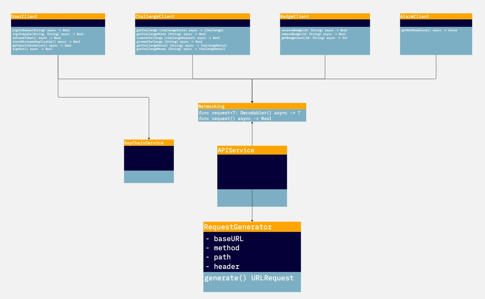

## 아이고 머니 - iOS 
상대방과 함께 합리적인 소비를 공유하며 돈의 소중함을 배우는 일주일 챌린지!

### 기간
- 2023.09. 15 ~ (진행중)

### 팀원

||
|:--:|
|[미니](https://github.com/leegyoungmin)|

### 개발환경 및 라이브러리
  

| 구분   | 라이브러리    |  버전   |
| ---------- | ------ |---------|
| UI | SwiftUI        | -  |
| 비동기 프로그래밍 | Swift Concurrency  | -  |
| 아키텍처 | TCA (MVI)   | 1.1.0  |

### 개발 다이어 그램
#### 클라이언트 구조

## 미리보기
<body>
    <iframe width="560" height="315" src="https://www.youtube.com/embed/Uss5qsSTfJY?si=oq9Psc-gFbNmScDR" title="YouTube video player" frameborder="0" allow="accelerometer; autoplay; clipboard-write; encrypted-media; gyroscope; picture-in-picture; web-share" allowfullscreen></iframe>
</body>
